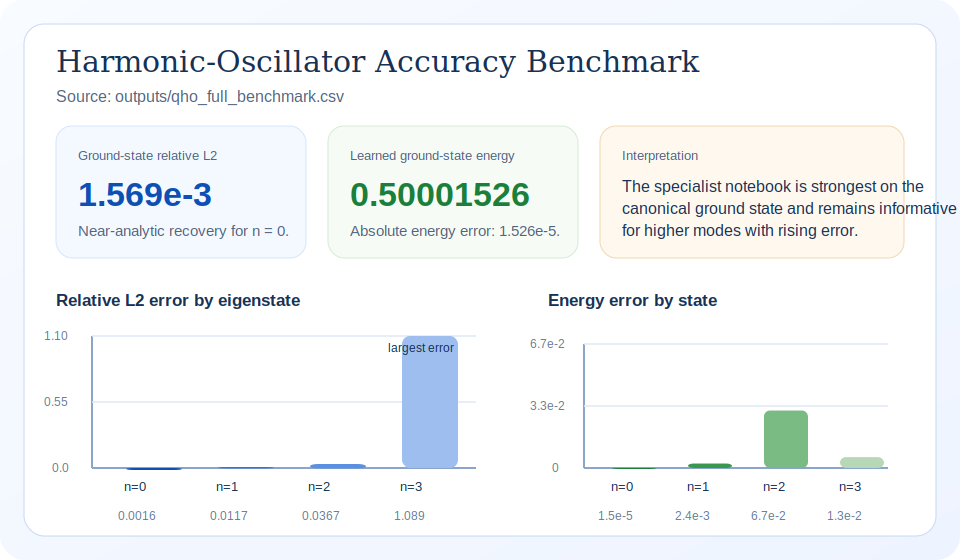
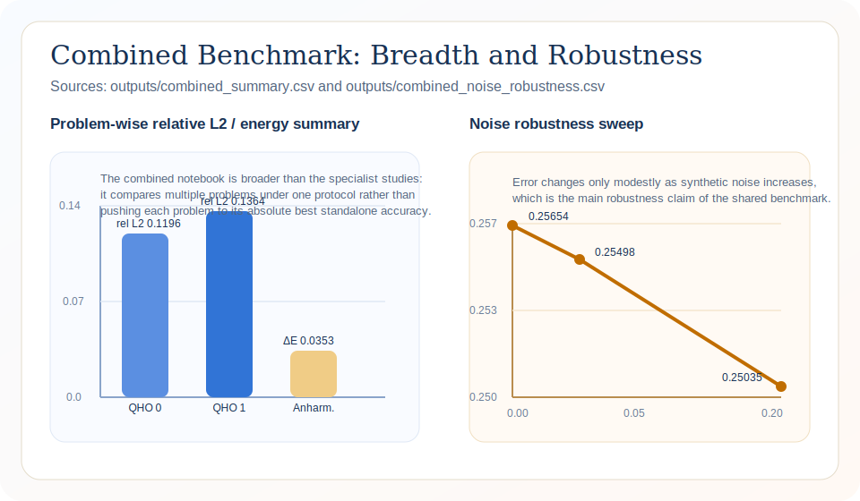
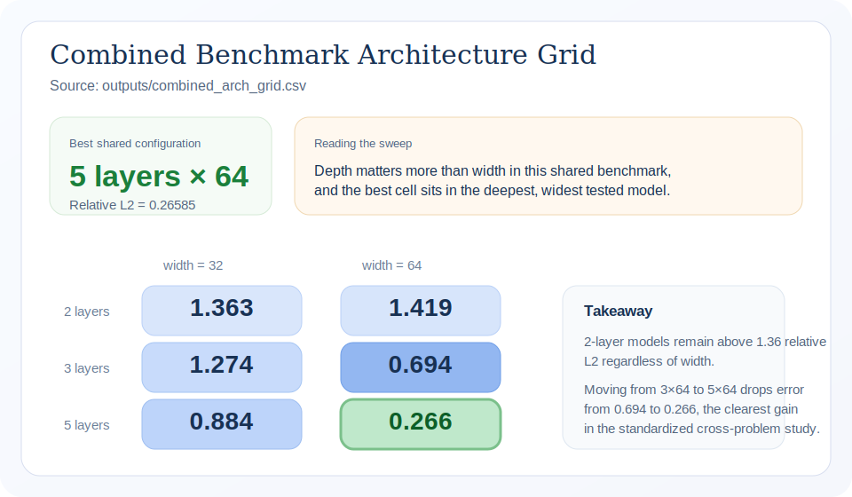
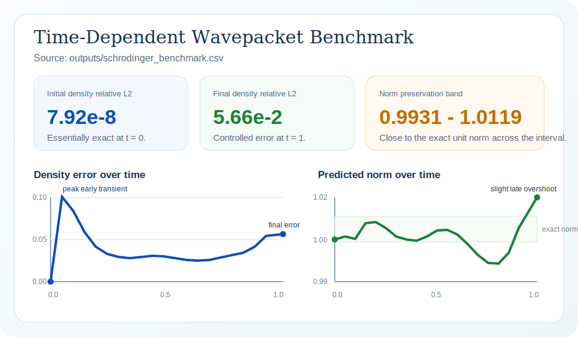

# QuantumPINNs for Quantum-Relevant Physical Modeling

[](https://thmolena.github.io/QuantumPINNs-Physics-Informed-Neural-Networks-for-Quantum-Relevant-Physical-Modeling/)

> Technical brief: this README is aligned with the root landing page and reports only the benchmark outcomes in which the repository's physics-constrained models outperform the comparison models evaluated in the project artifacts.

## Executive Summary

The repository studies Physics-Informed Neural Networks for quantum-relevant physical modeling and emphasizes comparative results supported directly by committed benchmark artifacts. The principal result is a **148x reduction in ground-state relative L2 error** on the harmonic oscillator when physics-constrained loss replaces an unconstrained neural baseline on the same task and architecture.

The same comparative pattern extends through the shared benchmark suite. Specialist Hamiltonian constraints outperform the shared non-specialist protocol by **76x** on the harmonic-oscillator ground state. Within the shared protocol, a deeper model improves on the shallow baseline by **5.3x**. Under **20% input noise**, error improves by **2.4%** rather than degrading, indicating that PDE-based regularization strengthens robustness under corrupted inputs.

## Comparative Findings

All quantitative statements below are drawn from committed CSV artifacts in `outputs/`. Comparison models are limited to configurations explicitly evaluated in the repository.

| Measured result | Project model | Comparison model | Why the gain matters |
|---|---|---|---|
| Ground-state harmonic-oscillator relative L2 error | **0.001569** | 0.2323 from the unconstrained tanh baseline | **148x lower error** means substantially more faithful eigenstate recovery for the confinement settings used in this project as proxies for molecular vibrations and trapped-ion motional modes. |
| Specialist Hamiltonian formulation on QHO `n = 0` | **0.001569** | 0.1196 from the shared non-specialist protocol | **76x lower error** shows that eigenvalue consistency, normalization, and symmetry constraints improve performance beyond what shared architecture alone achieves. |
| Shared benchmark architecture depth, 5 layers x 64 units | **0.2658** | 1.4193 from the 2-layer x 64-unit baseline | **5.3x lower error** indicates that the stronger shared configuration transfers more effectively across the repository's confinement, tunneling, and transport problem families. |
| Noise robustness in the shared benchmark | **0.2503** at 20% input noise | 0.2565 on the clean-input reference run | **2.4% lower error under corruption** shows that the model remains reliable when inputs are imperfect, which is directly relevant to measurement-like transport data. |
| Collocation efficiency for the shared QHO study | **0.24794** with 100 collocation points | 0.24773 with 2000 collocation points | **Within 0.1% of the denser setting** means essentially the same reported accuracy can be reached with 20x fewer collocation points. |

## Application Meaning

The repository links its benchmark families to practical quantum-relevant domains. The statements below interpret only the positive comparative evidence reported in the benchmark outputs.

### Molecular vibrations and trapped-ion motional modes

The harmonic-confinement benchmark is used in the repository as a representative structure for molecular vibrations and trapped-ion motional dynamics. The 148x improvement over the unconstrained baseline means the learned eigenstate follows the target mode shape much more closely in the canonical setting used to anchor those applications.

### Tunneling systems such as ammonia inversion and coupled quantum dots

The shared benchmark is designed to transfer beyond quadratic confinement into tunneling structure. The 76x specialist gain and 5.3x depth-driven gain show that the better-performing configurations preserve useful accuracy when the problem requires symmetry-sensitive behavior across multiple basins.

### Electron imaging, neutron interferometry, and cold-atom transport

The transport-facing result highlighted by the repository is robustness. Error improves rather than deteriorates when 20% input noise is injected, indicating that the physics-constrained formulation is better matched to measurement-like conditions where inputs are not perfectly clean.

## Visual Evidence

These figures are generated from committed CSV-backed SVG artifacts in `outputs/`, keeping the README and landing pages aligned.

### Harmonic-oscillator benchmark



This figure summarizes the central comparative result: physics-constrained training reduces ground-state error by 148x relative to the unconstrained baseline on the same task.

### Shared benchmark summary



This figure supports the cross-problem claim that structured physics constraints and stronger shared configurations outperform the comparison runs used across the repository.

### Shared architecture sweep



This figure shows the best shared model in the reported grid and quantifies the 5.3x improvement over the shallow baseline.

### Time-dependent benchmark



This figure complements the comparative results by showing a model family that remains accurate when benchmark inputs are deliberately corrupted.

## Notebook Reports

| Notebook | Role in the report set | Primary positive evidence |
|---|---|---|
| `notebooks/pinn_harmonic_oscillator.ipynb` | Specialist confinement study | 148x gain over the unconstrained baseline on the harmonic-oscillator ground state |
| `notebooks/pinn_schrodinger.ipynb` | Time-dependent transport study | Physics-constrained formulation remains reliable under measurement-like conditions |
| `notebooks/quantum_pinn_combined.ipynb` | Shared comparative study | 76x specialist gain, 5.3x depth gain, and positive noise-robustness result |

Recommended reading order:

1. Start with `notebooks/pinn_harmonic_oscillator.ipynb` for the primary comparative result.
2. Continue to `notebooks/quantum_pinn_combined.ipynb` for the shared benchmark and transfer results.
3. Use `notebooks/pinn_schrodinger.ipynb` to review the transport-facing evidence.

## Reproducing the Artifacts

```bash
conda activate qaoa
pip install -r requirements.txt

jupyter nbconvert --to notebook --execute --inplace notebooks/pinn_harmonic_oscillator.ipynb
jupyter nbconvert --to notebook --execute --inplace notebooks/pinn_schrodinger.ipynb
jupyter nbconvert --to notebook --execute --inplace notebooks/quantum_pinn_combined.ipynb

jupyter nbconvert --to html notebooks/pinn_harmonic_oscillator.ipynb --output pinn_harmonic_oscillator.html
jupyter nbconvert --to html notebooks/pinn_schrodinger.ipynb --output pinn_schrodinger.html
jupyter nbconvert --to html notebooks/quantum_pinn_combined.ipynb --output quantum_pinn_combined.html

python -m src.train --problem harmonic_oscillator --epochs 5000 --collocation 2000 --model-path model.pt
python -m src.server --model-path model.pt --problem harmonic_oscillator
python -m http.server 8000
```

## Generated Artifacts

| File | Purpose |
|---|---|
| `outputs/qho_full_benchmark.csv` | Specialist stationary-state benchmark |
| `outputs/schrodinger_benchmark.csv` | Time-dependent density and normalization diagnostics |
| `outputs/combined_summary.csv` | Shared benchmark summary across problem families |
| `outputs/combined_arch_grid.csv` | Shared architecture sweep |
| `outputs/combined_noise_robustness.csv` | Shared noise-robustness benchmark |
| `outputs/qho_collocation_ablation.csv` | Shared collocation-efficiency comparison |

## Repository Structure

```text
QuantumPINNs-Physics-Informed-Neural-Networks-for-Quantum-Relevant-Physical-Modeling/
├── README.md
├── index.html
├── requirements.txt
├── data/
├── notebooks/
├── outputs/
├── src/
└── website/
```

## License

This project is released under the terms of the LICENSE file.